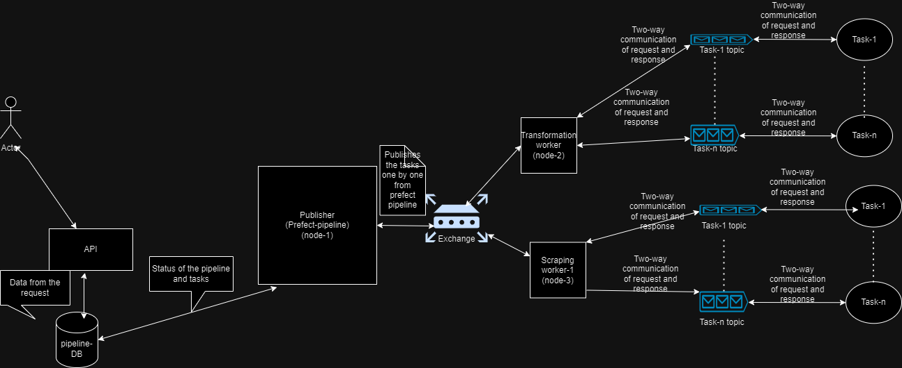

# Project Overview

This Django project is designed to create and manage data pipelines. The project comprises two primary components:

1.  **Task Publisher**: A [Prefect](https://docs.prefect.io/) pipeline responsible for publishing tasks in the order they are received from API requests via the user interface.

2.  **Task Executor**: A daemon process that executes tasks when they are published for it. These are the tasks that are deployed on different servers.  

To implement a 'publish-subscribe pattern,' [RabbitMQ](https://www.rabbitmq.com/documentation.html) is utilized.

# Server Setup

To set up the server, please refer to the guide provided in [this blog](https://medium.com/civicdatalab/data-orchestration-using-prefect-and-rabbitmq-6349096daca5).
Currently, the API requests are sent to `node-1` server that we are using as a publisher. 

# RabbitMQ Configuration

RabbitMQ requires specific configuration for long-running tasks. Follow these steps:

1.  Add the following line to the RabbitMQ configuration file: `/etc/rabbitmq/rabbitmq.conf` (create the file if it doesn't exist).

`consumer_timeout = 10800000`

The above line sets the consumer timeout to be 3 hours (in milliseconds).

2.  Ensure the RabbitMQ server can access the configuration file by granting the necessary permissions (e.g., `chmod 777`).

3.  After saving the configuration file, restart the RabbitMQ server using the following command:

`sudo systemctl restart rabbitmq-server`

4.  If the restart command takes too long to execute, you can stop the execution and force boot the RabbitMQ service with the following command:

`sudo rabbitmqctl force_boot`

After this, RabbitMQ server can be restarted.

The data pipelines should now be ready to operate efficiently.

The data pipelines should now be ready to operate efficiently.

## Project Flow



## Background tasks

To start the server to accept the API requests, run the following command.\
`python manage.py runserver` - This starts the Django server, and listens to the API requests. This can be considered an entry-point to our program. 

The following command needs to be run to push the API calls to queue. 

2.  `python manage.py runscript worker_demon.py` - Runs the rabbitmq - worker demon. This is responsible for translating API calls to models and publishing each task in the corresponding queue.  

## Sample API Request

A demo request to the shepherd API consists the following in the request body. 

    {
     "pipeline_name": "sentinel_pipeline",
     "data_url": "",
     "project": "ids-drr",
      "transformers_list" : [
           {
              "name": "sentinel",
              "order_no": 1, 
              "context": {
                  "date_start": "2023-05-01",
                  "date_end": "2023-06-01"
              }
           },
           {
              "name": "sentinel_upload_to_s3",
              "order_no": 2, 
              "context": {}
           }
        ]
    }

1.  *pipeline_name* - Name of the pipeline. This can be anything. 
2.  *data_url* - URL to the data file. Some pipelines don't need data file as an input. In that case keep this field empty. 
3.  *project* - Name of the project that the pipeline belongs to. Refer to [model_to_pipeline](pipeline/model_to_pipeline.py) for valid project names. 
4.  *transformers_list* - List of json objects that contains the details of the tasks.
    1.  *name* - Name of the task that needs to be performed. Please note that this name should be same as the method defined in the project flow.
    2.  *order_no* - The order number of the task. In the above example task - *sentinel* is followed by the task - *sentinel_upload_to_s3* owing to their order numbers.
    3.  *context* - Necessary inputs to perform the task. This is task specific. In the above example, the task - *sentinel* requires start and end dates as inputs.    

## Adding Publisher to the pipeline

Following are the steps to be followed to add a new task to the pipeline. 

1.  Define your task name and the context (i.e. necessary information to perform the task).
2.  The name of the publisher method, and the name of the task should be same. This is the name that we use in the *transformers_list* of API call.   
3.  Decide the project that you want to add the task in. Projects can be found in the [projects](projects) folder. 
4.  Generate the publisher code by running `python -m code_templates.publisher_template --task_name '<task_name>'` in a terminal.
5.  Paste the generated code in the Python file that contains the project flow. 
    The following line publishes the task along with the context and the data in the queue.
6.  `data, exception_flag = publish_task_and_process_result(task_obj, context, pipeline.data)  
     if not exception_flag:`
7.  Once the task is published and the worker finishes the task, the value returned by the worker will be stored in the variable named - `data` in the above line. Note that this data can be anything, say - a pandas dataframe, a path string etc. This will be saved in the pipeline object so that the next task can pick this up if needed. So, it is up to the task creator what to return.

# Writing the worker

1.  Worker is any piece of code that has a RabbitMQ wrapper around it so that if publisher publishes a task, it can pick the task up and execute the code. 
2. First, define the method that needs to be run as a RabbitMQ worker. The method should contain the following parameters.
   1. `context` - This would be a dictionary which contains actual parameters for the method. 
   2. `data_path` - The path where the final result would be stored.  
3. To create a worker it is essential to instantiate [worker_class](tasks/worker_class.py). The following lines of code will be needed inorder to run the worker
`
worker = Worker("task_name")
worker.add_task(method_name)
worker.start_worker()`
4. Save the file with `.py` extension and deploy it onto any server that is clustered with `node-1 server`. 
5. Once the worker code is deployed, it can be run with `python filename.py` - this will start the worker. Whenever the publisher publishes a message for this worker, worker picks the message, processes it and returns the response back to the publisher.

An example would make the steps clear. Suppose we need to add a task to add two numbers to the pipeline. The steps to be followed are as follows. 
1. Defining the task name and the context - let's name our task as `add_nums`. To add two numbers we would be needing two numbers as parameters. Hence, our context looks like the following
```
{
    "num1" : 10,
    "num2" : 20  
}
```
2. Now, to generate the publisher, run `python -m code_templates.publisher_template --add_nums`. This would generate a code that looks like the following.
```
@task
def add_nums(context, pipeline, task_obj):
    data, exception_flag = publish_task_and_process_result(task_obj, context, pipeline.data_path)
    if not exception_flag:    # if there's no error while executing the task
        # Replace the following with your own code if the need is different. 
        # Generally, to read the returned data into a dataframe and save it against the pipeline object for further tasks
        #df = pd.read_csv(StringIO(data), sep=',')
        pipeline.data_path = data
        # Following is a mandatory line to set logs in prefect UI
        set_task_model_values(task_obj, pipeline)
    else:
       pipeline.logger.error("ERROR: at add_nums")
```
Paste the above code in a relevant Prefect flow. 
3. Write the actual worker logic - as a method with `context` and `data_path` as the parameters. 
```
def add_numbers(context, data_path):
    # unwrap the parameters from the context
    num1 = context.get("num1")
    num2 = context.get("num2")
    result = num1 + num2
    return result # note that we are not using data_path here. We are just returning the result. 
```
4. Now, wrap the defined method within worker class using the following lines of code. 
```
worker = Worker("add_nums") # Note that the task name defined earlier is - add_nums 
worker.add_task(add_numbers) # add_numbers is the method that we defined
worker.start_worker()
```
5. The complete `add_nums_worker.py` file looks as follows. 
```
from worker import Worker # import the Worker class from worker_class

def add_numbers(context, data_path):
    num1 = context.get("num1")
    num2 = context.get("num2")
    result = num1 + num2
    return result

worker = Worker("add_nums") # Note that the task name defined earlier is - add_nums 
worker.add_task(add_numbers) # add_numbers is the method that we defined
worker.start_worker()
```
6. Save the file and run the worker by executing - `python add_nums_worker.py`
7. Start the server and send a Post request to execute the task through the pipeline. 
```
POST /transformer/pipe_create HTTP/1.1
Host: 127.0.0.1:8000
Content-Type: application/json
Content-Length: 207

{
 "pipeline_name": "pipe14",
 "data_url": "",
 "project": "generic_transformations",
  "transformers_list" : [
  {
    "name": "add_nums",
    "order_no": 1, 
    "context": {"num1": 100, "num2": -20}
  }
   ]
}
```
# API - documentation for the existing projects

The pipeline currently supports the following projects. 

1.  IDS-DRR
2.  Data for Districts

### IDS-DRR Sources and API calls to trigger them

-   #### BHUVAN
    BHUVAN has 4 tasks defined. The following API call is used to trigger those tasks one after the other. 

```commandLine
POST /transformer/pipe_create HTTP/1.1
Host: 43.205.116.57:8000
Content-Type: application/json
Content-Length: 680

{
    "pipeline_name": "Run BHUVAN source",
    "data_url": "",
    "project": "ids-drr",
    "transformers_list": [
        {
            "name": "bhuvan_get_dates",
            "order_no": 1,
            "context": {}
        },
        {
            "name": "bhuvan_gdal_wms",
            "order_no": 2,
            "context": {}
        },
        {
            "name": "bhuvan_remove_watermark",
            "order_no": 3,
            "context": {}
        },
        {
            "name": "bhuvan_transformer",
            "order_no": 4,
            "context": {
                "year": "2023",
                "month": "06"
            }
        }
    ]
}
```

-   #### SENTINEL

```commandline
POST /transformer/pipe_create HTTP/1.1
Host: 43.205.116.57:8000
Content-Type: application/json
Content-Length: 454

{
    "pipeline_name": "sentinel_pipeline",
    "data_url": "",
    "project": "ids-drr",
    "transformers_list": [
        {
            "name": "sentinel",
            "order_no": 1,
            "context": {
                "date_start": "2023-05-01",
                "date_end": "2023-06-01"
            }
        },
        {
            "name": "sentinel_upload_to_s3",
            "order_no": 2,
            "context": {}
        }
    ]
}
```

-   #### IMD

```commandline
POST /transformer/pipe_create HTTP/1.1
Host: 43.205.116.57:8000
Content-Type: application/json
Content-Length: 283

{
    "pipeline_name": "IMD pipeline",
    "data_url": "",
    "project": "ids-drr",
    "transformers_list": [
        {
            "name": "collect_imd_data",
            "order_no": 1,
            "context": {
                "year": "2022"
            }
        }
    ]
}
```

### Data for Districts tasks

--To be added--